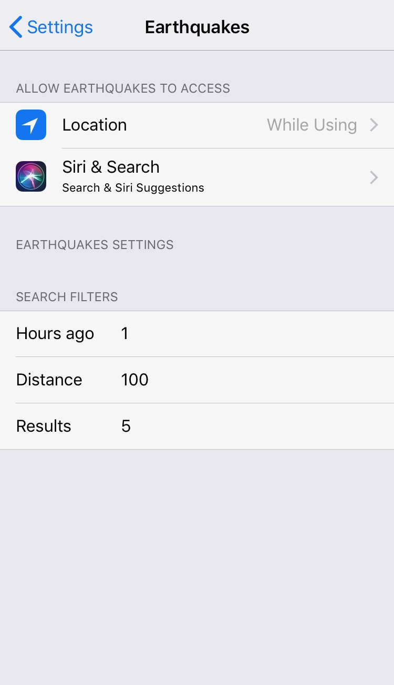

##Earthquakes

* Xcode 9.4.1
* iOS 10.0+

Example app to fetch earthquakes and display in the map

You can select a earthquake and see it in a map.

###You can set the default filters for all search, bases on:

**Hours ago**: Limit to events on or after the specified start time

**Distance**: Limit to events within the specified maximum number of kilometers from the geographic point defined by the latitude and longitude parameters

**Results**: Limit the results to the specified number of events

</img>
</img>